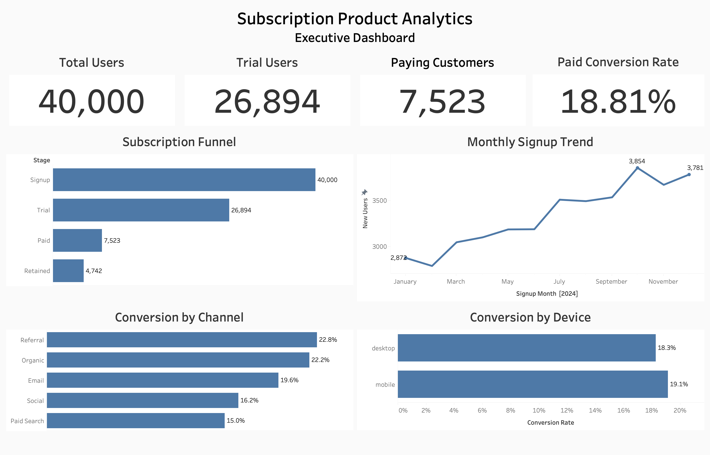
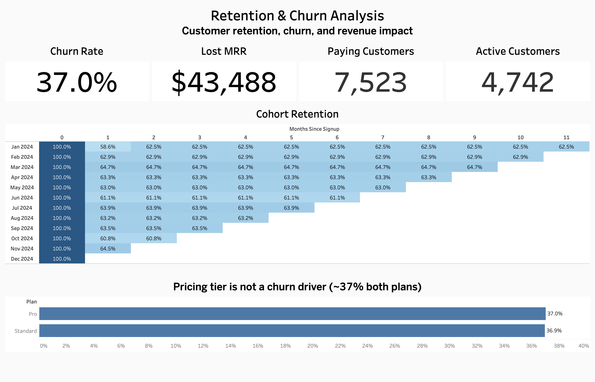
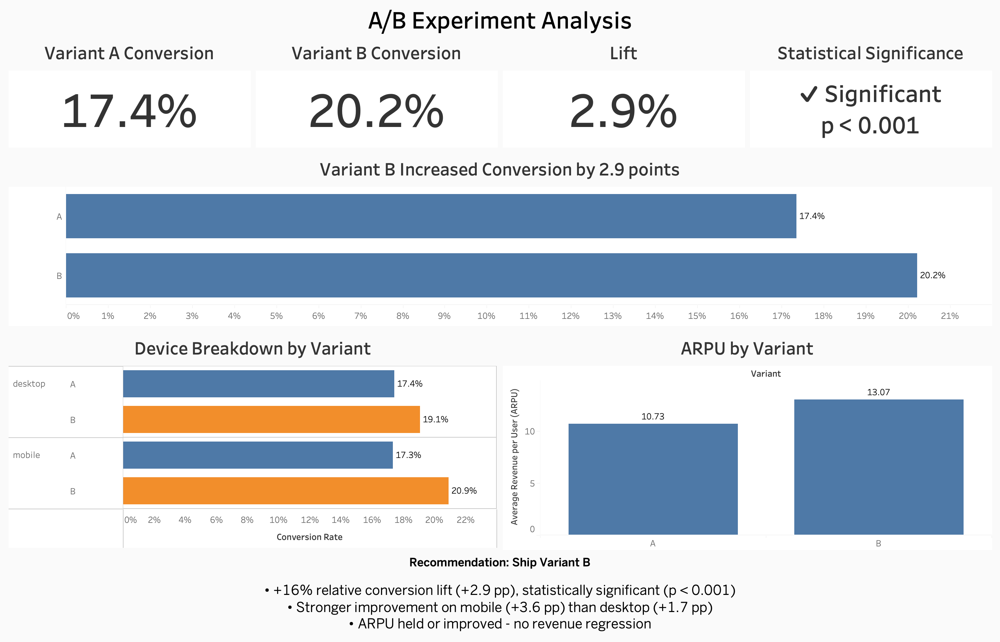

# Subscription Product Analytics: End-to-End Product Analytics Case Study



End-to-end subscription product analytics project covering SQL analysis, customer acquisition, product funnel optimization, cohort retention, churn analysis, A/B experimentation, statistical validation, and executive dashboard development.

**Tech Stack:** PostgreSQL · SQL · Python · Tableau · Git · GitHub

**Key Outcome:** Built an end-to-end analytics workflow that identified the highest-converting acquisition channels, quantified retention and churn (37% churn, ~$43K lost MRR), and demonstrated that **Variant B increased paid conversion from 17.4% to 20.2% (+2.9 pp, p < 0.001)** while increasing revenue per user.

**Live dashboards:** [Subscription Product Analytics on Tableau Public](https://public.tableau.com/app/profile/naveen.raj.kanagaraj/viz/SubscriptionProductAnalytics/ExecutiveOverview)

---

## Executive Summary

Subscription businesses rely on continuous measurement of acquisition, conversion, retention, and experimentation to maximize recurring revenue and customer lifetime value.

This project simulates the workflow of a Product Analyst by analyzing the complete customer lifecycle of a subscription SaaS business. Starting from raw subscription data, I designed a PostgreSQL database, wrote analytical SQL, validated an A/B experiment in Python, and built executive Tableau dashboards - translating findings into actionable product recommendations.

---

## Business Problem

This analysis addresses the following business questions:

- Where do users drop off in the subscription funnel?
- Which acquisition channels generate the highest-paying customers?
- How does customer retention evolve across cohorts?
- How much Monthly Recurring Revenue (MRR) is lost through churn?
- Is churn driven by subscription plan?
- Did the new onboarding experience improve paid conversion, and should Variant B roll out to all users?

---

## Project Highlights

- End-to-end analytics workflow using PostgreSQL, SQL, Python, and Tableau.
- Analyzed **40,000 users**, **303,012 product events**, and **30,429 payments**.
- Three executive dashboards covering acquisition, retention, and experimentation.
- Statistical validation of an A/B experiment (SRM check, z-test, confidence interval, guardrails).
- Business recommendations supported by quantitative evidence.

---

## Tech Stack

| Category | Tools |
|----------|-------|
| Database | PostgreSQL |
| Query Language | SQL |
| Programming | Python (Pandas, NumPy, SciPy, Statsmodels) |
| Visualization | Tableau |
| Development | VS Code, Jupyter Notebook, pgAdmin 4 |
| Version Control | Git & GitHub |

---

## Analytics Workflow

```text
Synthetic Subscription Dataset
        │
        ▼
   PostgreSQL Database
        │
        ▼
      SQL Analysis
(Funnel • Retention • Churn • Revenue)
        │
        ▼
Python Statistical Validation (A/B Testing)
        │
        ▼
    Tableau Dashboards
        │
        ▼
 Business Recommendations
```

---

## Dataset

A synthetic subscription SaaS dataset designed to simulate realistic customer behavior while providing a known analytical ground truth for experimentation.

| Table | Records |
|-------|--------:|
| Users | 40,000 |
| Events | 303,012 |
| Payments | 30,429 |
| Subscriptions | 26,894 |
| Experiment Assignment | 40,000 |

The dataset captures user acquisition, subscription lifecycle, product events, recurring payments, and experiment assignment across a relational schema.

---

## SQL Analysis

- Subscription funnel and paid-conversion analysis (intent-to-treat denominators)
- Monthly signup trends
- Cohort retention analysis (CTEs + window functions)
- Customer churn and lost Monthly Recurring Revenue (MRR)
- Conversion by acquisition channel, device, and country
- Experiment dataset preparation

Each SQL query was independently validated against the underlying data before being incorporated into the Tableau dashboards to ensure consistency across analyses.

---

## Python Statistical Analysis

Python validated the A/B experiment and translated the statistics into a business decision:

- Experiment dataset preparation (one row per user)
- Sample-ratio-mismatch (SRM) validity check (chi-square, α = 0.001)
- Two-proportion z-test
- 95% confidence interval estimation
- Device-level segment analysis
- Guardrail metric evaluation (Revenue per User)
- Business interpretation and rollout recommendation

The analysis showed the improvement in Variant B was statistically significant and unlikely to have occurred by chance.

---

## Dashboard 1 – Executive Overview


A high-level summary of acquisition, conversion, and subscription performance for product managers and business stakeholders.

**KPIs:** Total Users · Trial Users · Paying Customers · Paid Conversion Rate

**Visuals:** Subscription Funnel · Monthly Signup Trend · Conversion by Acquisition Channel · Conversion by Device

**Key Findings**

- The largest customer drop-off is between trial and paid conversion.
- Referral generated the highest paid conversion (~22.8%), followed by Organic (~22.2%).
- Paid Search produced the weakest conversion (~15%).
- Mobile users converted slightly better than desktop.

**Recommendations:** Increase investment in Referral and Organic; re-evaluate Paid Search; reduce trial→paid drop-off through onboarding.

---

## Dashboard 2 – Customer & Retention Insights



Focuses on retention, churn, and recurring revenue to identify where long-term customer value is lost.

**KPIs:** Churn Rate · Lost MRR · Paying Customers · Active Customers

**Visuals:** Cohort Retention Heatmap · Churn by Subscription Plan

**Key Findings**

- Retention declines most sharply after the first billing cycle, then stabilizes.
- ~37% of paying customers churned, driving measurable MRR loss (~$43K).
- Churn is nearly identical across plans, so pricing is not the primary driver.

**Recommendations:** Improve first-month onboarding; focus on activation and engagement over pricing changes; keep monitoring cohort retention.

---

## Dashboard 3 – A/B Experiment Analysis



Evaluates a controlled A/B experiment comparing two onboarding experiences, validated in Python before visualization.

**KPIs:** Variant A Conversion · Variant B Conversion · Conversion Lift · Statistical Significance

**Visuals:** Variant Comparison · Device Breakdown · ARPU by Variant

**Results**

- Variant A: **17.4%** → Variant B: **20.2%**
- Absolute lift: **+2.9 pp** · Relative lift: **+16%** · 95% CI [+2.1, +3.6 pp] · **p < 0.001**
- Largest improvement on mobile (+3.6 pp vs +1.7 pp desktop)
- Guardrail — ARPU improved (10.73 → 13.07); no revenue regression

**Recommendation:** Roll out Variant B to 100% of users; continue monitoring post-launch retention and revenue guardrails to confirm long-term performance.

---

## Overall Business Recommendations

**Immediate:** Roll out Variant B; increase Referral and Organic investment; reduce dependence on Paid Search.

**Medium term:** Improve onboarding to cut first-month churn; monitor activation immediately after signup.

**Long term:** Build predictive churn models; expand experimentation; optimize customer lifetime value.

---

## Repository Structure

```text
subscription-product-analytics/
├── dashboards/
│   ├── dashboard1_executive_overview.png
│   ├── dashboard2_retention_churn.png
│   └── dashboard3_ab_experiment.png
├── data/
│   ├── users.csv
│   ├── subscriptions.csv
│   ├── payments.csv
│   ├── events.csv
│   ├── experiment_assignment.csv
│   ├── experiment_dataset.csv
│   ├── funnel_stages.csv
│   └── cohort_retention.csv
├── docs/
│   ├── data_dictionary.md
│   ├── methodology.md
│   └── business_recommendations.md
├── sql/
│   ├── 00_create_tables.sql
│   ├── 01_funnel.sql
│   ├── 02_retention.sql
│   ├── 03_churn.sql
│   ├── 04_ab_test_aggregates.sql
│   ├── 05_experiment_dataset.sql
│   └── views.sql
├── statistics/
│   └── ab_test.ipynb
├── tableau/
│   └── subscription_product_analytics.twbx
├── README.md
└── .gitignore
```

---

## Skills Demonstrated

**Product Analytics**
- Funnel Analysis
- Cohort Analysis
- Churn Analysis
- Product Experimentation
- KPI Design

**Marketing Analytics**
- Acquisition Channel Analysis
- Conversion Optimization
- Customer Segmentation
- Revenue Analysis

**Technical**
- PostgreSQL
- SQL
- Python
- Pandas
- NumPy
- SciPy
- Statsmodels
- Tableau
- Git
- GitHub

**Statistics**
- A/B Testing
- Hypothesis Testing
- Two-Proportion Z-Test
- Confidence Intervals
- Sample Ratio Mismatch (SRM) Validation

**Business Intelligence**
- Dashboard Development
- Executive Reporting
- Data Visualization
- Business Storytelling

---

## Limitations

This project uses a synthetic subscription dataset generated to model a realistic SaaS business and validate the analytical workflow against a known experimental effect. Churn is intentionally modeled as a one-time event at first renewal, so cohort retention plateaus after the initial decline rather than decaying gradually; the cohort methodology is unchanged and would surface a declining curve on production data. While the underlying data is synthetic, the analytical workflow, statistical methodology, and business decision framework reflect common practices used by product analytics teams in subscription-based technology companies.

---

## Future Work

- Predictive churn modeling
- Customer Lifetime Value (CLV) estimation
- CUPED variance reduction
- Marketing attribution analysis
- Additional onboarding experiments
- Pricing optimization experiments
- Subscription forecasting

---

## Author

**Naveen Raj Kanagaraj** — Master of Science in Marketing Analytics, DePaul University

[LinkedIn](https://www.linkedin.com/in/naveen-raj-kanagaraj-8234b6352/) 
[Tableau Public](https://public.tableau.com/app/profile/naveen.raj.kanagaraj/vizzes)